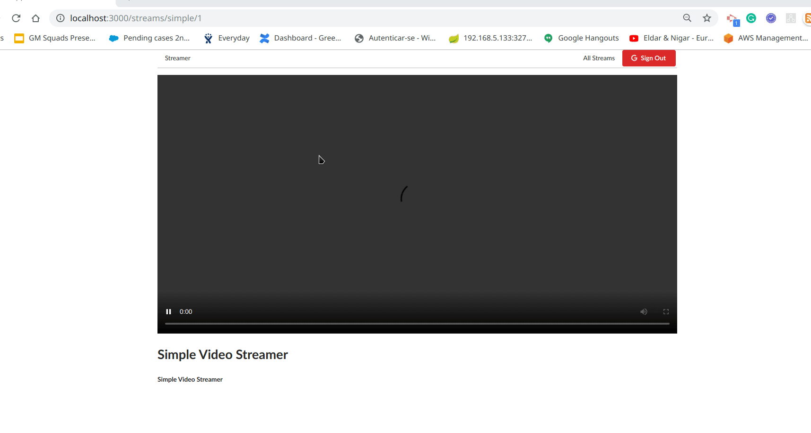

# Stream Video React APP

this is a react web app cabable of making http requests to a RTMP server which receives videos streamed through a software called [OBS](https://obsproject.com/)

## The project is comprised of the following main parts

 1) A client project which runs on port 3000, where most of our DOM elements are and where our server requests originate from.
 2) A rtmp project, it uses the library [Node-Media-Server](https://github.com/illuspas/Node-Media-Server) to create a rtmp server which receives the http requests on port 8000 from our client and is fed by the OBS software with videos on port 1935.
 3) An api project responsible for crud operations for our client project which runs on port 3001. 
 
 ## Main Tecno Tools 

 1) React
 2) Redux
 3) Javascript
 4) JSX
 5) CSS

### Sample of the stream being provided through OBS and being accessed by our React APP.

